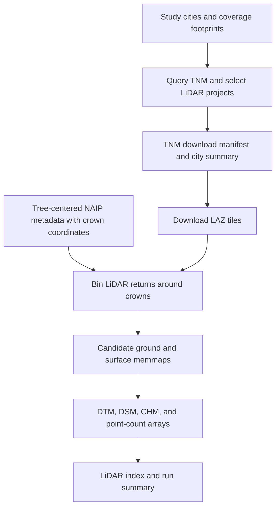

# Tree-Centered LiDAR Data Pipeline

This folder contains the workflow for discovering and downloading USGS 3D
Elevation Program (3DEP) LiDAR tiles and creating DTM, DSM, CHM, and point-count
products centered on identified tree crowns.


## Folder contents

| File | Purpose |
|---|---|
| `identify_tnm_lidar_city_coverage.py` | Queries TNM and provides the city-footprint, coordinate, sampling, and catalog helpers used during manifest construction. |
| `build_tnm_lidar_download_manifest.py` | Queries The National Map (TNM), evaluates city coverage, selects suitable LiDAR projects, and writes download manifests. |
| `download_tnm_lidar_manifest.py` | Downloads the LAZ files in the manifest with restartable, bounded parallelism. |
| `create_tree_centered_lidar_crop_products_laspy_pipeline.py` | Creates crown-centered DTM, DSM, CHM, and point-count products from downloaded LAZ/LAS files. |
| `tree_centered_lidar_utils.py` | Shared manifest, CRS, vertical-unit, memmap, and output utilities. This module is imported by the product generator and is not run directly. |

Generated manifests, status files, summaries, `__pycache__`, and `.pyc` files
are not source code and can be regenerated.

## Requirements

Use a Python environment containing:

- Python 3.10 or newer;
- NumPy and pandas;
- laspy with a LAZ backend such as `lazrs`;
- pyproj;
- sufficient disk space for downloaded LAZ files and intermediate memmaps.

Example installation:

```powershell
python -m pip install numpy pandas laspy lazrs pyproj
```

The TNM discovery and download steps require internet access. Product creation
is local once the LAZ files have been downloaded.

## Workflow overview



## Inputs

### Coverage inputs for TNM discovery

The current manifest builder expects:

- city coverage tables beneath
  `dataCollection/Sentinel2/mccoy_sentinel_10m_cells_utm/<city>/`;
- `dataCollection/NAIP/naip_county_manifest.json` for city names and
  three-letter codes.

These coverage tables are used only to select TNM projects and LAZ tiles. They
are not used as model records or LiDAR chip centers.

### Crown metadata for product creation

The product generator reads one metadata CSV per city from:

```text
H:\TreeCenteredModelInputs\tree_centered_naip_crops_clean\<city>\
  <city>_tree_id_centered_nearest_64px_metadata.csv
```

The filename is controlled by `--metadata-pattern`. Required fields are:

- `crop_index`;
- `crop_failed`;
- either `peak_x_utm` or `crown_x_utm`;
- either `peak_y_utm` or `crown_y_utm`;
- either `crown_epsg` or a `cell_id` containing an EPSG code.

Recommended fields are:

- `tree_id`;
- `tree_centered_index`;
- `crop_metres` and `crop_size`;
- `source_file` and `source_row`;
- `taxon_label`.

The clean NAIP crown extractor produces metadata matching this contract.

## 1. Build a TNM download manifest

Begin with one city and a dry run:

```powershell
python dataCollection\LiDAR\build_tnm_lidar_download_manifest.py `
  --cell-map-dir dataCollection\Sentinel2\mccoy_sentinel_10m_cells_utm `
  --city-manifest dataCollection\NAIP\naip_county_manifest.json `
  --lidar-root E:\LiDAR `
  --city-token atlanta `
  --dry-run
```

Generate the manifest after reviewing project age and coverage:

```powershell
python dataCollection\LiDAR\build_tnm_lidar_download_manifest.py `
  --cell-map-dir dataCollection\Sentinel2\mccoy_sentinel_10m_cells_utm `
  --city-manifest dataCollection\NAIP\naip_county_manifest.json `
  --lidar-root E:\LiDAR `
  --output-csv dataCollection\LiDAR\tnm_lidar_download_manifest.csv `
  --output-json dataCollection\LiDAR\tnm_lidar_download_manifest.json `
  --city-summary-csv dataCollection\LiDAR\tnm_lidar_download_city_summary.csv
```

Important selection options:

- `--city-token`: restrict to a city name, folder token, or code; repeatable;
- `--project-selection best|all`: select one preferred project or retain all;
- `--min-project-year`: reject older projects by default;
- `--preferred-project-year`: prefer sufficiently complete newer projects;
- `--allow-stale-projects`: permit projects older than the minimum;
- `--allow-event-projects`: allow flood, wildfire, hurricane, or other
  event-specific collections to compete normally;
- `--max-coverage-points`: subsample coverage footprints for faster discovery;
- `--max-tiles-per-city`: cap tiles during a smoke test;
- `--no-verify-tls`: troubleshooting option for environments with TLS issues.

Review `tnm_lidar_download_city_summary.csv` before downloading. Confirm:

1. the selected project year is acceptable;
2. coverage is sufficient for the intended crowns;
3. event-specific or stale projects were not selected unintentionally;
4. the expected tile count and download size are reasonable.

## 2. Download the LAZ tiles

Inspect the queue without downloading:

```powershell
python dataCollection\LiDAR\download_tnm_lidar_manifest.py `
  --manifest dataCollection\LiDAR\tnm_lidar_download_manifest.csv `
  --lidar-root E:\LiDAR `
  --city-token atlanta `
  --max-downloads 5 `
  --dry-run
```

Download one city:

```powershell
python dataCollection\LiDAR\download_tnm_lidar_manifest.py `
  --manifest dataCollection\LiDAR\tnm_lidar_download_manifest.csv `
  --status-json dataCollection\LiDAR\tnm_lidar_download_status.json `
  --lidar-root E:\LiDAR `
  --city-token atlanta `
  --workers 4 `
  --per-city 2 `
  --resume-partial
```

Remove `--city-token` to download the entire manifest. The default `city`
schedule finishes one city before launching the next; use `--schedule global`
to prioritize the full manifest instead.

The downloader:

- skips files whose existing size is complete;
- writes `.partial` files during active transfers;
- updates the manifest with attempts, timestamps, downloaded bytes, and errors;
- periodically writes `tnm_lidar_download_status.json`;
- can resume partial HTTP downloads with `--resume-partial`.

Downloaded files default to:

```text
E:\LiDAR\<relative_path from manifest>
```

Avoid `--overwrite` unless existing LAZ files are known to be corrupt.

## 3. Test crown-centered LiDAR product creation

The product generator has two stages:

- `bin`: read LAZ points and create restartable ground/surface/count memmaps;
- `derive`: select the preferred project and derive DTM, DSM, CHM, count
  products, and the row index;
- `all`: run both stages, which is the default.

Start with one city, a small record limit, and a tile limit:

```powershell
python dataCollection\LiDAR\create_tree_centered_lidar_crop_products_laspy_pipeline.py `
  --manifest dataCollection\LiDAR\tnm_lidar_download_manifest.csv `
  --city-summary dataCollection\LiDAR\tnm_lidar_download_city_summary.csv `
  --crop-root H:\TreeCenteredModelInputs\tree_centered_naip_crops_clean `
  --lidar-root E:\LiDAR `
  --output-root H:\TreeCenteredModelInputs\tree_centered_lidar_products_clean `
  --city-token atlanta `
  --max-records 100 `
  --max-tiles 2 `
  --dry-run
```

Remove `--dry-run` for the smoke test. After verifying its outputs, rerun the
city without `--max-records` and `--max-tiles` in a clean output directory.

## 4. Create full crown-centered products

```powershell
python dataCollection\LiDAR\create_tree_centered_lidar_crop_products_laspy_pipeline.py `
  --stage all `
  --manifest dataCollection\LiDAR\tnm_lidar_download_manifest.csv `
  --city-summary dataCollection\LiDAR\tnm_lidar_download_city_summary.csv `
  --crop-root H:\TreeCenteredModelInputs\tree_centered_naip_crops_clean `
  --lidar-root E:\LiDAR `
  --output-root H:\TreeCenteredModelInputs\tree_centered_lidar_products_clean `
  --pixel-size 1 `
  --bin-workers 1 `
  --derive-workers 1
```

Useful options:

- `--city-token` and `--exclude-city-token`: select cities;
- `--crop-metres`: override the metadata footprint width;
- `--pixels`: override output pixels per side;
- `--target-epsg`: override the city output CRS;
- `--laspy-source-epsg`: fallback when a LAS/LAZ header has no CRS;
- `--tile-point-chunk-size`: stream unusually large tiles in chunks;
- `--checkpoint-every-tiles`: control bin-state checkpoint frequency;
- `--auto-accept-coverage`: minimum preferred-project coverage;
- `--preference-penalty`: penalty applied to lower-ranked candidate projects;
- `--allow-empty-products`: permit cities without usable returns;
- `--overwrite`: discard existing candidate state and rebuild;
- `--retry-active-tile`: retry an interrupted active tile only when it is known
  not to have flushed partial updates.

Keep `--bin-workers` modest. Each worker reads LAZ tiles and writes several
large memmaps.

## Vertical units and classifications

By default, the generator inspects sample LAS/LAZ CRS metadata and attempts to
convert vertical values to metres. Review the saved scaling reason and
confidence for every project.

Relevant options:

- `--auto-z-scale` / `--no-auto-z-scale`;
- `--z-scale`, such as `0.3048` for feet to metres;
- `--z-units`;
- `--z-scale-table` for per-city or per-project overrides;
- `--z-scale-audit-tiles` to control the number of inspected headers.

An override CSV may contain:

```csv
city_token,city_code,project,z_scale,z_units,confidence,reason
atlanta,ATL,example_project,1.0,meters,reviewed,manual_header_review
```

Default point classifications are:

- DTM: class `2` (ground);
- DSM: classes `1,2,3,4,5,6,9,17`.

Override these using `--dtm-class-codes` and `--dsm-class-codes` only after
reviewing the source project classification scheme.

## Outputs

The default output root is:

```text
H:\TreeCenteredModelInputs\tree_centered_lidar_products_clean\
```

It contains:

```text
Candidates\<city>\<project>\Binned\  restartable intermediate memmaps
DTM\<city>\                         ground elevation arrays
DSM\<city>\                         surface elevation arrays
CHM\<city>\                         canopy-height arrays and LiDAR index
Point_Counts\<city>\                return-count arrays
```

The CHM is derived from DSM minus DTM after applying the selected vertical
scale. The LiDAR index preserves tree/crop identifiers, source project,
coverage, and summary statistics required for later alignment.

The run summary defaults to:

```text
dataCollection\LiDAR\tree_centered_lidar_crop_products_laspy_summary.csv
```

## Restart and recovery

- Completed bin markers cause the bin stage to skip finished candidates.
- Bin-state JSON records processed and active tiles.
- Interrupted runs can normally be rerun without `--overwrite`.
- If a run stopped during an active tile, inspect its state before using
  `--retry-active-tile`; double-counting is possible if partial updates were
  flushed.
- Use `--overwrite` only when intentionally rebuilding candidate memmaps.

## QA checklist

Before adding LiDAR products to model shards:

1. Confirm the LiDAR index and crown metadata have matching tree identifiers.
2. Confirm DTM, DSM, CHM, and count arrays have identical record and raster
   dimensions.
3. Verify `CHM >= 0` for valid pixels and inspect extreme canopy heights.
4. Review ground and surface return coverage by city and project.
5. Inspect vertical-unit inference and manually verify ambiguous projects.
6. Review several CHM chips alongside their corresponding NAIP crown crops.
7. Investigate cities with low coverage, empty products, or extensive missing
   ground returns.
8. Preserve the original LAZ files and manifests until products have been
   validated and backed up.

After QA, the clean CHM products can be converted to structure sidecars using
`dataCollectionPreprocessing/LiDAR/derive_clean_tree_id_centered_chm_structure_sidecars.py`:

```powershell
python dataCollectionPreprocessing/LiDAR/derive_clean_tree_id_centered_chm_structure_sidecars.py `
  --crop-root H:/TreeCenteredModelInputs/tree_centered_naip_crops_clean `
  --lidar-product-root H:/TreeCenteredModelInputs/tree_centered_lidar_products_clean `
  --output-dir H:/TreeCenteredModelInputs/tree_centered_chm_structure_clean `
  --dry-run
```

Review the discovered city inputs, then remove `--dry-run`. The resulting
`*_tree_id_centered_chm_structure_metrics.npz` sidecars are consumed by the QA
and shard-assembly stages.

`naip_chm_structure_metrics.py` contains the shared NAIP/CHM feature definitions
used by the sidecar builder and is not normally run directly.
