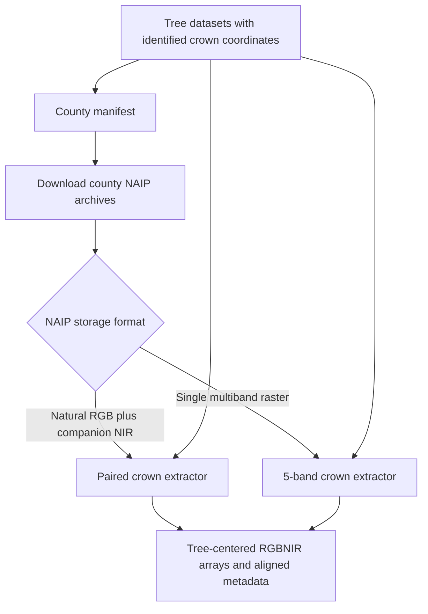

# Tree-Centered NAIP Data Pipeline

This folder contains the NAIP workflow used to download county imagery and
create RGBNIR image chips centered on identified tree crowns. The current
pipeline operates on crown coordinates directly; it does not create
Sentinel-cell-centered chips.

## Folder contents

| File | Purpose |
|---|---|
| `build_county_manifest.py` | Intersects inventory coordinates with county boundaries and creates `naip_county_manifest.json`. |
| `county_boundaries.geojson` | County polygons used by the manifest builder. |
| `download_naip_paired_box.py` | Selects and downloads same-year natural-color and companion/NIR county archives from the NRCS Box archive. |
| `extract_tree_id_centered_naip_crops.py` | Creates crown-centered RGBNIR chips from paired natural-color and companion/NIR archives. |
| `extract_tree_id_centered_5band_naip_crops.py` | Creates crown-centered RGBNIR chips from single multiband NAIP rasters. |
| `tree_centered_naip_utils.py` | Shared raster, archive, reprojection, block-reading, resizing, and QA utilities. This is imported by the extractors and is not run directly. |

## Requirements

Run the crop extractors with the ArcGIS Pro Python environment. They require:

- ArcPy for reading MrSID rasters;
- NumPy and pandas;
- pyproj when projected crown coordinates are not already present;
- enough temporary disk space to extract `.sid` files from downloaded ZIPs.

The Box downloader additionally requires Playwright and an installed Edge
browser. If necessary, install Playwright into the interpreter used for the
download step:

```powershell
python -m pip install playwright
python -m playwright install msedge
```

## Crown-coordinate input

Each city should have one clean tree-to-crown join CSV. The default layout is:

```text
H:\TreeCenteredModelInputs\tree_to_detected_crowns_clean\<city>\
  <city>_tree_to_nearest_detected_crown_5m.csv
```

Create these joins with
`dataCollectionPreprocessing/treeCrown/spatial_join_clean_tree_records_to_detected_crowns.py`
after running the tree detector. See `dataCollectionPreprocessing/treeCrown/README.md`
for the expected crown-center input schema.

Both extractors require these columns:

- `tree_id`: unique tree record identifier;
- `crown_id`: identifier of the matched/identified crown;
- `crown_epsg`: EPSG code for the crown coordinate system;
- `match_distance_m`: distance between the inventory tree and identified crown.

Coordinates may be supplied as either:

- `crown_x_utm` and `crown_y_utm`, which are used directly; or
- `crown_lon` and `crown_lat`, which are projected using `crown_epsg`.

The paired extractor also preserves the tree-coordinate and crown-coordinate
columns present in the input CSV. `tree_id` values must be unique within a
city file.

## Workflow overview



## 1. Prepare the county manifest

Both paired archive discovery and crown extraction use
`naip_county_manifest.json` to map a city name to its three-letter storage
code and counties. This generated file is not currently stored in the folder,
so create or supply it before running the paired workflow.

The expected structure is:

```json
{
  "cities": [
    {
      "city": "Atlanta",
      "code": "ATL",
      "points": 1000,
      "counties": [
        {
          "geoid": "13121",
          "state": "GA",
          "county_fips": "121",
          "name": "Fulton"
        }
      ]
    }
  ],
  "unmatched": []
}
```

To generate it with `build_county_manifest.py`, first set the script's
`SOURCE`, `BOUNDARIES`, and `OUTPUT` constants:

- `SOURCE`: directory containing city inventory CSV files named
  `City_Final_*.csv`;
- `BOUNDARIES`: this folder's `county_boundaries.geojson`;
- `OUTPUT`: this folder's `naip_county_manifest.json`.

Inventory files used by the builder must contain longitude and latitude in
`longitude_coordinate`/`latitude_coordinate` or their plural variants. Then
run from the repository root:

```powershell
python dataCollection\NAIP\build_county_manifest.py
```

Review the reported unmatched points and confirm every new city has a unique
entry in the script's `CODES` mapping.

## 2. Download paired county NAIP archives

Use a dry run for one city first:

```powershell
python dataCollection\NAIP\download_naip_paired_box.py `
  --manifest dataCollection\NAIP\naip_county_manifest.json `
  --output E:\NAIP_PAIRED `
  --target-year 2022 `
  --year-window 6 `
  --test-city Atlanta `
  --dry-run
```

Remove `--dry-run` to download that city. To download every city in the
manifest:

```powershell
python dataCollection\NAIP\download_naip_paired_box.py `
  --manifest dataCollection\NAIP\naip_county_manifest.json `
  --output E:\NAIP_PAIRED `
  --target-year 2022 `
  --year-window 6
```

Useful options:

- `--city-code ATL` restricts processing by storage code and is repeatable;
- `--state GA` restricts processing by state and is repeatable;
- `--refresh-index` refreshes the cached Box archive listing;
- `--headed` opens a visible browser for troubleshooting;
- `--download-limit N` limits downloads during a test.

Downloaded files are preserved as:

```text
E:\NAIP_PAIRED\<CITY_CODE>\*.zip
```

The downloader selects a same-county, same-year natural-color archive (`hn`
or `nc`) and companion/CIR archive (`hc`).

## 3. Create paired RGB plus NIR crown chips

This is the standard path for cities downloaded through the paired archive
workflow. The extractor resolves the city code through
`naip_county_manifest.json`, pairs county archives by state/county/year,
extracts their SID members when necessary, and tests overlapping pairs at each
crown. The crop with the lowest blackout/whiteout saturation is retained.

Run a small first-N test:

```powershell
python dataCollection\NAIP\extract_tree_id_centered_naip_crops.py `
  --city-token atlanta `
  --join-root H:\TreeCenteredModelInputs\tree_to_detected_crowns_clean `
  --naip-dir E:\NAIP_PAIRED `
  --county-manifest dataCollection\NAIP\naip_county_manifest.json `
  --output-dir H:\TreeCenteredModelInputs\tree_centered_naip_crops_clean `
  --crop-size 64 `
  --crop-metres 38 `
  --max-records 100
```

After inspecting the test output, remove `--max-records`. Multiple cities can
be processed by repeating `--city-token`:

```powershell
python dataCollection\NAIP\extract_tree_id_centered_naip_crops.py `
  --city-token atlanta `
  --city-token denver `
  --join-root H:\TreeCenteredModelInputs\tree_to_detected_crowns_clean `
  --naip-dir E:\NAIP_PAIRED `
  --county-manifest dataCollection\NAIP\naip_county_manifest.json `
  --output-dir H:\TreeCenteredModelInputs\tree_centered_naip_crops_clean `
  --parallel-workers 2
```

If no `--city-token` is supplied, the extractor discovers cities from the
join-root summary or city subdirectories. Use `--exclude-city-token` to skip
specific cities.

## 4. Create crown chips from single multiband rasters

Use the 5-band extractor for cities whose imagery is stored in one multiband
SID product rather than separate natural-color and companion archives. Run one
city per command:

```powershell
python dataCollection\NAIP\extract_tree_id_centered_5band_naip_crops.py `
  --city-token baltimore `
  --join-csv H:\TreeCenteredModelInputs\tree_to_detected_crowns_clean\baltimore\baltimore_tree_to_nearest_detected_crown_5m.csv `
  --naip-dir E:\NAIP_PAIRED\BAL `
  --sid-pattern *.sid `
  --bands 1,2,3,4 `
  --output-dir H:\TreeCenteredModelInputs\tree_centered_naip_crops_clean `
  --crop-size 64 `
  --crop-metres 38 `
  --max-records 100
```

Remove `--max-records` for the full run. `--bands` is one-based and must list
the source bands in output order: red, green, blue, NIR. ZIP archives beneath
the selected city directory are searched and matching SID members are
extracted automatically.

Use `--source-epsg EPSG:...` only when `crown_epsg` should intentionally be
overridden. Use `--sid-path-rewrite OLD=NEW` when
running against legacy index files containing paths from another computer.

## Outputs and restart behavior

Both extractors write one city directory containing:

- `*_rgbnir_crops.npy`: `uint8` array shaped `(records, 64, 64, 4)` by default;
- `*_metadata.csv`: row-aligned tree/crown metadata, source raster provenance,
  crop QA metrics, and `crop_failed`;
- `*_config.json`: inputs and settings used for the run;
- `*_progress.json` and `*.partial.npy`: temporary restart files removed after
  successful completion.

Default output root:

```text
H:\TreeCenteredModelInputs\tree_centered_naip_crops_clean\<city>\
```

Interrupted runs resume from their progress files. Existing completed outputs
are protected; pass `--force` only when they should be regenerated.

## QA checks

Before assembling model shards:

1. Confirm the crop array and metadata CSV have the same number of rows.
2. Confirm `tree_id` is unique and remains aligned with `crop_index`.
3. Review `crop_failed`; investigate or exclude failed records.
4. Review `crop_blackout_fraction`, `crop_whiteout_fraction`,
   `crop_saturation_fraction`, and `crop_valid_fraction`.
5. Visually inspect a sample in RGB and false-color NIR.
6. Confirm source SID paths and band assignments are plausible for every city.

Do not remove downloaded ZIP archives until crown crops and their metadata have
been validated and backed up.

## Inspection and QA utilities

`inspect_sid_metadata.py` prints ArcPy raster, spatial-reference, and per-band
statistics for a source SID file. It supports future source inspection but is
not required for every crop-building run.
